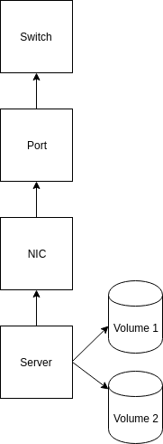

# Needs

## Introduction

My point of view :

A CMDB provides an organized view of your network's configuration data and a way to examine that data from any perspective.

## Most important features

I would like to develop a project to design a CMDB tool with the following features:
- flexible
- ergonomic = nice frontend to use
- allows simple visualization of dependencies between CI

## Features

The project must include these features:
- flexible management of nosql type objects
- provide a way to self-discovery (but not necessarily native)
- API available for reading or writing easily
- Native *ACL* to the product for reading and writing for each document, see finesse of access to certain fields of a document.
- Management of tags: of course you can tagged the data (especially collections), nice tags : location, hardware, system, middleware, application, service
- a graphical orientation of objects (CI relationship) and their visualization

### Feature CI relationship

The product shoud manage the relationship between object, for example this is a study case :

The CMDB must be able to provide relevant information about the impact analysis (if this server falls, which service is impacted behind it?)

